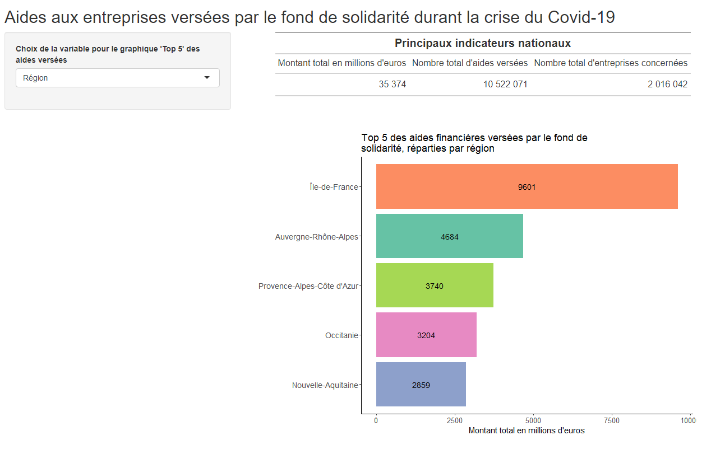
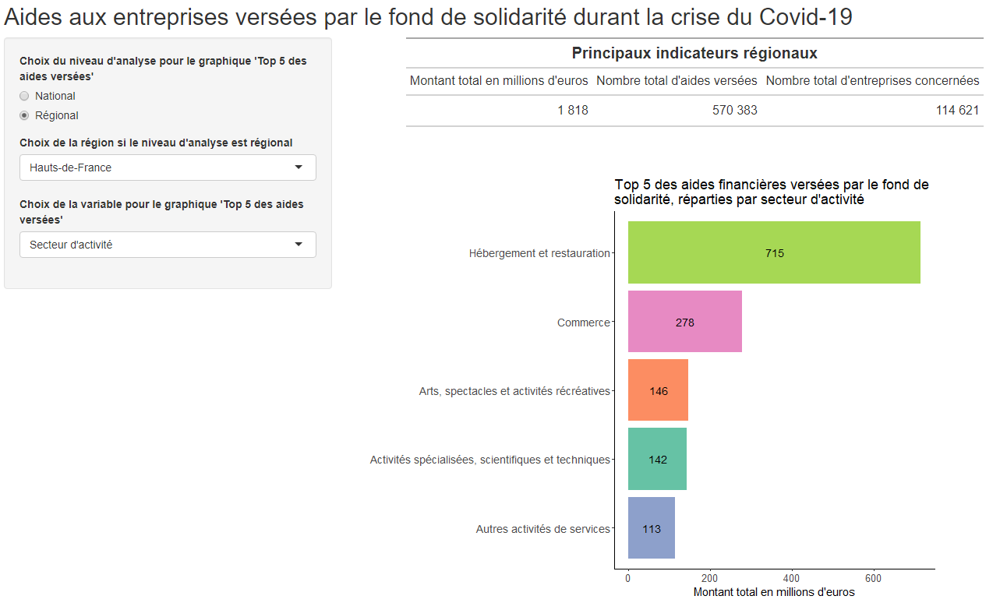

# Application sur Shiny  {#c12-Retour-sur-Shiny}
<div align="justify">

Nous pouvons maintenant mettre en pratique ces connaissances plus approfondies acquises sur le package **`Ggplot`**, en créant une application Shiny dont nous avions vu les bases lors de séances précédentes.


## Application avec un tableau et un graphique
On va d'abord créer une application en mettant en haut un tableau général récapitulant  pour la France entière les informations suivantes : le montant total d'aides financières versées, le nombre total d'aides versées, et le nombre total d'entreprises concernées ; puis en-dessous de ce tableau, on va ajouter un graphique (barplot) qui va représenter le "top 5" des aides versées selon, soit la région, soit le secteur d'activité.  
Ainisi, le premier tableau ne sera pas à ce stade réactif, alors que le graphique le sera.  
Pour le tableau, vous pouvez utiliser le package **`gt()`** et la fonction `gt_output()` pour l'appel du tableau dans la partie **UI** associée à la fonction `render_gt()` dans la partie **server**.  
Cela doit vous donner ceci :


```{r eval=FALSE}
# Chargement des librairies
library(shiny)
library(tidyverse)
library(gt)
library(RColorBrewer)
library(forcats)


# Chargement du fichier final
#dt_aidesCovid <- readRDS("data/dt_aidesCovid.RData")


# Définition UI et Server de l'application Shiny
ui <- fluidPage(
  # Titre de l'application
  titlePanel("Aides aux entreprises versées par le fond de solidarité durant la crise du Covid-19"),
  
  # Définition du Widget
  sidebarLayout(
    sidebarPanel(
      selectInput(inputId = "variable", 
                  label = "Choix de la variable pour le graphique 'Top 5' des aides versées", 
                  choices = list("Région" = "reg_name", "Secteur d'activité" = "naf_section_name"),
                  selected = "Secteur d'activité")
      ),
    
    # Tableau et graphe montré à l'utilisateur
    mainPanel(
      gt_output("tab"),
      
      br(),
      br(),
      br(),
      
      plotOutput("barplot", height = 550, width = 750)    
    )
  )
)


server <- function(input, output) {
  
  output$tab <- render_gt({
    dt_aidesCovid %>% 
      summarise("Montant total en millions d'euros"=sum(total_meuros),
                "Nombre total d'aides versées"=sum(financial_support_count),
                "Nombre total d'entreprises concernées"=sum(nombre_entreprises)) %>% 
      gt() %>%  
      fmt_number(columns= 1:3, sep_mark = " ", decimals = 0) %>% 
      tab_header(title=md('**Principaux indicateurs nationaux**'))
  })


  output$barplot <- renderPlot({
    dt_aidesCovid %>% 
      group_by(!!sym(input$variable)) %>%  # ou utiliser la fonction `group_by_at(input$variable)`
      summarise(montant_total = round(sum(total_meuros))) %>% 
      arrange(desc(montant_total)) %>% slice(1:5) %>% 
      ggplot() + aes(x = montant_total, y = fct_reorder(!!sym(input$variable), montant_total), fill=!!sym(input$variable)) + 
      geom_bar(stat="identity")  +
      geom_text(aes(label=montant_total), position = position_stack(vjust=0.5), size=5) +
      labs(title=paste("Top 5 des aides financières versées par le fond de \nsolidarité, réparties par", 
                       if(input$variable=="reg_name"){"région"} else {"secteur d'activité"}),
           x = "Montant total en millions d'euros", y = " ") +
      scale_fill_brewer(palette="Set2") +
      theme_classic() +
      theme(legend.position = "none", plot.title=element_text(size=18),
            axis.text.y = element_text(size=14),
            axis.text.x = element_text(size=13),
            axis.title.x = element_text(size=14.5))
  })
  
}


shinyApp(ui = ui, server = server)
```

D'abord, comme lors d'un précédent exemple Shiny, lorsque le nom de la variable était de type "string" (chaîne de caractères) dans les choix du widget on avait dû utiliser la fonction `aes_string()` au lieu du simple `aes()` dans **Ggplot** ; ici, de même, on a dû utiliser un autre code qu'habituellement pour appeler la variable `input$variable` dans la fonction `group_by()` : les doubles `!!` (appelés "bang-bang") et la fonction `sym()`. Ce code fait plus précisément deux choses : il convertit d'abord la chaîne de caractères fournie par `input$variable` en un symbole en utilisant la fonction `sym()`, puis il utilise l'opérateur `!!` qui est une syntaxe d'évaluation qui permet ici d'enlever les guillemets ('unquoting'), en gros il permet ici de dire à la fonction `group_by` "OK, maintenant évalue l'expression que je t'ai donnée et substitue le bon résultat à la place". À savoir, on aurait pu aussi utiliser, à la place de `group_by()`, la fonction `group_by_at()` en appelant directement dans ce cas l'`input$variable` dans les parenthèses.   
Il faut donc *faire attention* à la manière dont sont définis les choix de variables dans la fonction `UI` : si ce sont des chaînes de caractères ('string') alors certaines fonctions de `**R-base**` ou de `**tidyverse**` ne pourront pas s'y appliquer directement, il faudra soit transformer ces variables à l'aide notamment de la double-fonction `!!sym()`, soit trouver une fonction proche qui fonctionne avec ce type de variable 'string' comme `aes_string()` dans `**Ggpplot**` ou `group_by_at()`.

Ensuite, on a utilisé du langage html pour mettre des espaces entre le tableau et le graphique. Et, pour que le graphique soit adapté à la fenêtre et donc modifier sa taille, on a utilisé les options `height=` et `width=` indiquées dans la fonction `plotOutput()` (il est possible également de les indiquer à la fin de la fonction `renderPlot({})` entre le `{` et la dernière `)`).   

Enfin, on a mis une fonction à l'intérieur du `labs()` de **`Ggplot`** pour que le titre change selon la variable utilisée et qu'elle affiche un nom plus parlant que le nom de la variable.  


## Introduction d'une réactivité appliquée à la table de données
On peut rendre maintenant la base de données réactive avec la fonction `reactive({})`. On l'avait vu, la fonction `reactive()` permet de créer un objet réactif qui est à la fois une entrée réactive et une sortie réactive, l’objet va donc se mettre à jour automatiquement si les entrées qu’il utilise changent, et il va automatiquement déclencher la mise à jour des sorties où il est utilisé.  
La fonction permet techniquement de décomposer du code réactif et est utile lorsque certaines parties du code sont utilisées par plusieurs output car elle va permettre alors d'éviter des redondances. Cela peut être le cas lorsqu'on doit filtrer et/ou sélectionner des mêmes variables en input pour plusieurs outputs.  
Ici, on va décomposer la partie 'data' du code précédent de la partie construction du graphique ; le rendu sera strictement le même ; mais cela peut être plus efficace en cas de long code et d'application complexe car en gros on va exécuter qu'une seule fois l'opération 'data' réalisée ici.  
Attention, la base réactive créée est une fonction, il faut donc l'appeler avec des parenthèses !

```{r eval=FALSE}
# Chargement des librairies
library(shiny)
library(tidyverse)
library(gt)
library(RColorBrewer)
library(forcats)


# Chargement du fichier final
#dt_aidesCovid <- readRDS("data/dt_aidesCovid.RData")


# Définition UI et Server de l'application Shiny
ui <- fluidPage(
  # Titre de l'application
  titlePanel("Aides aux entreprises versées par le fond de solidarité durant la crise du Covid-19"),
  
  # Définition du Widget
  sidebarLayout(
    sidebarPanel(
      selectInput(inputId = "variable", 
                  label = "Choix de la variable pour le graphique 'Top 5' des aides versées", 
                  choices = list("Région"="reg_name", "Secteur d'activité"="naf_section_name"),
                  selected = "Secteur d'activité")
      ),
    
    # Tableau et graphe montré à l'utilisateur
    mainPanel(
      gt_output("tab"),
      
      br(),
      br(),
      br(),
      
      plotOutput("barplot",  height = 550, width = 750)    
    )
  )
)


server <- function(input, output) {
  
  output$tab <- render_gt({
    dt_aidesCovid %>% 
      summarise("Montant total en millions d'euros"=sum(total_meuros),
                "Nombre total d'aides versées"=sum(financial_support_count),
                "Nombre total d'entreprises concernées"=sum(nombre_entreprises)) %>% 
      gt() %>%  
      fmt_number(columns= 1:3, sep_mark = " ", decimals = 0) %>% 
      tab_header(title=md('**Principaux indicateurs nationaux**'))
  })
  

aidesCovid_react <- reactive({
  dt_aidesCovid %>%
  group_by(!!sym(input$variable)) %>%
  summarise(montant_total = round(sum(total_meuros))) %>%
  arrange(desc(montant_total)) %>% slice(1:5)
  })

output$barplot <- renderPlot({
  aidesCovid_react() %>%
    ggplot() + aes(x = montant_total, y = fct_reorder(!!sym(input$variable), montant_total), fill=!!sym(input$variable)) +
    geom_bar(stat="identity")  +
    geom_text(aes(label=montant_total), position = position_stack(vjust=0.5), size=5) +
    labs(title=paste("Top 5 des aides financières versées par le fond de \nsolidarité, réparties par",
                     if(input$variable=="reg_name"){"région"} else {"secteur d'activité"}),
         x = "Montant total en millions d'euros", y = " ") +
    scale_fill_brewer(palette="Set2") +
    theme_classic() +
    theme(legend.position = "none", plot.title=element_text(size=18),
          axis.text.y = element_text(size=14),
          axis.text.x = element_text(size=13),
          axis.title.x = element_text(size=14.5))
})
  
}


shinyApp(ui = ui, server = server)
```


## Introduction d'une réactivité sur les inputs sans changer les outputs (contexte réactif)
On va essayer d'ajouter un nouveau widget pour choisir le niveau d'analyse : - national, où l'on montre le tableau général précédent et le graphique selon la région ou le secteur d'activité ; - régional, où l'on montre le tableau général en haut (qui reste identique) et le graphique en bas qui varie cette fois selon le département ou le secteur d'activité.  
On peut pour cela utiliser la fonction `observe()` : on l'utilise donc quand un input change mais sans changer d'output.  
Il va falloir ici utiliser à l'intérieur de la fonction `observe()` une condition `if ... else ...` car on veut que : on part du principe qu'on affiche d'abord automatiquement le niveau "National", puis lorsque l'utilisateur appuie sur le bouton "Régional" du nouveau widget `radioButtons`, le widget `selectInput` doit être actualisé en permettant un choix entre cette fois le département ou le secteur d'activité, et enfin lorsqu'il revient sur le bouton "National" du `radioButtons`, le `selectInput` doit reprendre ses valeurs initiales.  
Il faut donc utiliser la fonction `observe()`, une condition `if ... else ...` et une actualisation des widgets avec la fonction `updateSelectInput()`.  
L'image suivante vous donne un aperçu de ce qu'on devrait avoir : 


```{r eval=FALSE}
# Chargement des librairies
library(shiny)
library(tidyverse)
library(gt)
library(RColorBrewer)
library(forcats)


# Chargement du fichier final
#dt_aidesCovid <- readRDS("data/dt_aidesCovid.RData")


# Définition UI et Server de l'application Shiny
ui <- fluidPage(
  # Titre de l'application
  titlePanel("Aides aux entreprises versées par le fond de solidarité durant la crise du Covid-19"),
  
  # Définition du Widget
  sidebarLayout(
    sidebarPanel(
      radioButtons(inputId = "niveau_analyse", 
                   label = "Choix du niveau d'analyse  pour le graphique 'Top 5 des aides versées'",
                   choices = c("National", "Régional"),
                   selected = "National"),
      selectInput(inputId = "variable", 
                  label="Choix de la variable  pour le graphique 'Top 5 des aides versées'",
                  choices = list("Région"="reg_name", "Secteur d'activité"="naf_section_name"),
                  selected = "Région")
    ),
    
    # Tableau et graphe montré à l'utilisateur
    mainPanel(
      gt_output("tab"),
      
      br(),
      br(),
      br(),
      
      plotOutput("barplot",  height = 550, width = 750)    
    )
  )
)


server <- function(input, output) {
    
  output$tab <- render_gt({
    dt_aidesCovid %>% 
      summarise("Montant total en millions d'euros"=sum(total_meuros),
                "Nombre total d'aides versées"=sum(financial_support_count),
                "Nombre total d'entreprises concernées"=sum(nombre_entreprises)) %>% 
      gt() %>%  
      fmt_number(columns= 1:3, sep_mark = " ", decimals = 0) %>% 
      tab_header(title=md('**Principaux indicateurs nationaux**'))
  })
  
  observe({
    input$niveau_analyse
    if(input$niveau_analyse == "Régional"){
      updateSelectInput(inputId = "variable",
                        choices = list("Département"="dep_name","Secteur d'activité"="naf_section_name"),
                        selected = "Département")
      } 
    else {updateSelectInput(inputId = "variable",
                            choices = list("Région"="reg_name", "Secteur d'activité"="naf_section_name"),
                            selected = input$variable)
    }
  })
  
  aidesCovid_react <- reactive({
    dt_aidesCovid %>%
      group_by(!!sym(input$variable)) %>%
      summarise(montant_total = round(sum(total_meuros))) %>%
      arrange(desc(montant_total)) %>% slice(1:5)
  })
  
  output$barplot <- renderPlot({
    aidesCovid_react() %>%
      ggplot() + aes(x = montant_total, y = fct_reorder(!!sym(input$variable), montant_total), fill=!!sym(input$variable)) +
      geom_bar(stat="identity")  +
      geom_text(aes(label=montant_total), position = position_stack(vjust=0.5), size=5) +
      labs(title=paste("Top 5 des aides financières versées par le fond de \nsolidarité, réparties par", 
                       if(input$variable=="reg_name"){"région"} else if (input$variable=="naf_section_name"){"secteur d'activité"}
                       else{"département"}),
           x = "Montant total en millions d'euros", y = " ") +
      scale_fill_brewer(palette="Set2") +
      theme_classic() +
      theme(legend.position = "none", plot.title=element_text(size=18),
            axis.text.y = element_text(size=14),
            axis.text.x = element_text(size=13),
            axis.title.x = element_text(size=14.5))
  })
  
}


shinyApp(ui = ui, server = server)

```


## Introduction d'une réactivité sur les inputs ET les outputs
Dans la continuité, on souhaite changer le graphique pour que lorsqu'on se situe au niveau régional, on ait cette fois le graphique du Top 5 des aides versées selon les départements de la région choisie, alors que précédemment cela nous indiquait les 5 premiers départements toutes régions confondues.  
Il faut donc d'abord ajouter un widget `selectInput` qui initialement (lorsqu'on est au niveau "National") ne prenne aucune valeur, mais lorsqu'on sera sur le niveau régional, on l'actualise pour avoir le choix d'une région. Il faut donc dans la fonction `observe()` actualiser 2 widgets maintenant.  
Ensuite, on va modifier notre base de données réactive en ajoutant un filtre selon la région choisie : mais ce filtre ne doit s'appliquer que lorsque l'utilisateur est au niveau "Régional", il faut pour cela introduire dans la fonction `filter()` une condition `if(input$niveau_analyse == "Régional") (reg_name %in% input$choix_region) else TRUE`.  
L'image suivante vous donne un aperçu de ce qu'on devrait avoir : 


```{r eval=FALSE}
# Chargement des librairies
library(shiny)
library(tidyverse)
library(gt)
library(RColorBrewer)
library(forcats)


# Chargement du fichier final
#dt_aidesCovid <- readRDS("data/dt_aidesCovid.RData")


# Définition UI et Server de l'application Shiny
ui <- fluidPage(
  # Titre de l'application
  titlePanel("Aides aux entreprises versées par le fond de solidarité durant la crise du Covid-19"),
  
  # Définition du Widget
  sidebarLayout(
    sidebarPanel(
      radioButtons(inputId = "niveau_analyse", 
                   label = "Choix du niveau d'analyse  pour le graphique 'Top 5 des aides versées'",
                   choices = c("National", "Régional"),
                   selected = "National"),
      selectInput(inputId = "choix_region", 
                  label = "Choix de la région si le niveau d'analyse est régional",
                  choices = " ",
                  selected = " "),
      selectInput(inputId = "variable", 
                  label="Choix de la variable  pour le graphique 'Top 5 des aides versées'",
                  choices = list("Région"="reg_name", "Secteur d'activité"="naf_section_name"),
                  selected = "Région")
    ),
    
    # Tableau et graphe montré à l'utilisateur
    mainPanel(
      gt_output("tab"),
      
      br(),
      br(),
      br(),
      
      plotOutput("barplot",  height = 550, width = 750)    
    )
  )
)

server <- function(input, output) {
  
  output$tab <- render_gt({
    dt_aidesCovid %>% 
      summarise("Montant total en millions d'euros"=sum(total_meuros),
                "Nombre total d'aides versées"=sum(financial_support_count),
                "Nombre total d'entreprises concernées"=sum(nombre_entreprises)) %>% 
      gt() %>%  
      fmt_number(columns= 1:3, sep_mark = " ", decimals = 0) %>% 
      tab_header(title=md('**Principaux indicateurs nationaux**'))
  })
  
  observe({
    input$niveau_analyse
    if(input$niveau_analyse == "Régional"){
      updateSelectInput(inputId = "choix_region", 
                        label = "Choix de la région si le niveau d'analyse est régional",
                        choices = unique(dt_aidesCovid$reg_name),
                        selected = "Île-de-France") 
      updateSelectInput(inputId = "variable",
                        choices = list("Département"="dep_name", "Secteur d'activité"="naf_section_name"),
                        selected = "Secteur d'activité")
    }  else {
      updateSelectInput(inputId = "variable",
                        choices = list("Région"="reg_name", "Secteur d'activité"="naf_section_name"),
                        selected = input$variable)
      updateSelectInput(inputId = "choix_region", 
                        label = "Choix de la région si le niveau d'analyse est régional",
                        choices = " ",
                        selected = " ")
    }
  })
  
  aidesCovid_reactfilt <- reactive({
    dt_aidesCovid %>%
      filter(if(input$niveau_analyse == "Régional") (reg_name %in% input$choix_region) else TRUE) %>% 
      group_by(!!sym(input$variable)) %>%
      summarise(montant_total = round(sum(total_meuros))) %>%
      arrange(desc(montant_total)) %>% slice(1:5)
  })
  
  output$barplot <- renderPlot({
    aidesCovid_reactfilt() %>%
      ggplot() + aes(x = montant_total, y = fct_reorder(!!sym(input$variable), montant_total), fill=!!sym(input$variable)) +
      geom_bar(stat="identity")  +
      geom_text(aes(label=montant_total), position = position_stack(vjust=0.5), size=5) +
      labs(title=paste("Top 5 des aides financières versées par le fond de \nsolidarité, réparties par", 
                       if(input$variable=="reg_name"){"région"} else if (input$variable=="naf_section_name"){"secteur d'activité"}
                       else {"département"}),
           x = "Montant total en millions d'euros", y = " ") +
      scale_fill_brewer(palette="Set2") +
      theme_classic() +
      theme(legend.position = "none", plot.title=element_text(size=18),
            axis.text.y = element_text(size=14),
            axis.text.x = element_text(size=13),
            axis.title.x = element_text(size=14.5))
      })   
  
}


shinyApp(ui = ui, server = server)

```
  

  

Pour que cela soit encore plus pertinent, on va également modifier le tableau général des indicateurs pour qu'il soit, lui aussi, réactif selon le niveau d'analyse choisi.  On va utiliser la fonction `observeEvent()` avec une condition `if ... else ...` pour que le tableau change selon le filtre de la région. Si l'on ne veut pas mettre une telle condition dans la fonction `observeEvent()`, il faut créer un base réactive comme précédemment.  
L'image suivante vous donne un aperçu de ce qu'on devrait avoir : 


```{r eval=FALSE}
# Chargement des librairies
library(shiny)
library(tidyverse)
library(gt)
library(RColorBrewer)
library(forcats)


# Chargement du fichier final
#dt_aidesCovid <- readRDS("data/dt_aidesCovid.RData")


# Définition UI et Server de l'application Shiny
ui <- fluidPage(
  # Titre de l'application
  titlePanel("Aides aux entreprises versées par le fond de solidarité durant la crise du Covid-19"),
  
  # Définition du Widget
  sidebarLayout(
    sidebarPanel(
      radioButtons(inputId = "niveau_analyse", 
                   label = "Choix du niveau d'analyse  pour le graphique 'Top 5 des aides versées'",
                   choices = c("National", "Régional"),
                   selected = "National"),
      selectInput(inputId = "choix_region", 
                  label = "Choix de la région si le niveau d'analyse est régional",
                  choices = " ",
                  selected = " "),
      selectInput(inputId = "variable", 
                  label="Choix de la variable  pour le graphique 'Top 5 des aides versées'",
                  choices = list("Région"="reg_name", "Secteur d'activité"="naf_section_name"),
                  selected = "Région")
    ),
    
    # Tableau et graphe montré à l'utilisateur
    mainPanel(
      gt_output("tab"),
      
      br(),
      br(),
      br(),
      
      plotOutput("barplot",  height = 550, width = 750)    
    )
  )
)

server <- function(input, output, session) {
  
  observe({
    input$niveau_analyse
    if(input$niveau_analyse == "Régional"){
      updateSelectInput(inputId = "choix_region", 
                        label = "Choix de la région si le niveau d'analyse est régional",
                        choices = unique(dt_aidesCovid$reg_name),
                        selected = "Île-de-France") 
      updateSelectInput(inputId = "variable",
                        session = session,
                        choices = list("Département"="dep_name","Secteur d'activité"="naf_section_name"),
                        selected = "Secteur d'activité")
    }  else {updateSelectInput(inputId = "variable",
                               session = session,
                               choices = list("Région"="reg_name", "Secteur d'activité"="naf_section_name"),
                               selected = input$variable)
      updateSelectInput(inputId = "choix_region", 
                        label = "Choix de la région si le niveau d'analyse est régional",
                        choices = " ",
                        selected = " ")
    }
  })
  
  observeEvent(input$niveau_analyse,
               if(input$niveau_analyse == "National"){
                 output$tab <- render_gt({
                   dt_aidesCovid %>% 
                     summarise("Montant total en millions d'euros"=sum(total_meuros),
                               "Nombre total d'aides versées"=sum(financial_support_count),
                               "Nombre total d'entreprises concernées"=sum(nombre_entreprises)) %>% 
                     gt() %>%  
                     fmt_number(columns = 1:3, 
                                sep_mark = " ", decimals = 0) %>% 
                     tab_header(title=md('**Principaux indicateurs nationaux**'))
                 })                 
               } 
               else{output$tab <- render_gt({
                 dt_aidesCovid %>%
                   filter(reg_name %in% input$choix_region) %>% 
                     summarise("Montant total en millions d'euros"=sum(total_meuros),
                               "Nombre total d'aides versées"=sum(financial_support_count),
                               "Nombre total d'entreprises concernées"=sum(nombre_entreprises)) %>% 
                     gt() %>%  
                     fmt_number(columns = 1:3, 
                                sep_mark = " ", decimals = 0) %>% 
                   tab_header(title=md('**Principaux indicateurs régionaux**'))
               })   
               }
  )
  
  aidesCovid_reactfilt <- reactive({
    dt_aidesCovid %>%
      filter(if(input$niveau_analyse == "Régional") (reg_name %in% input$choix_region) else TRUE) %>% 
      group_by(!!sym(input$variable)) %>%
      summarise(montant_total = round(sum(total_meuros))) %>%
      arrange(desc(montant_total)) %>% slice(1:5)
  }) 
  
  output$barplot <- renderPlot({
    aidesCovid_reactfilt() %>%
      ggplot() + aes(x = montant_total, y = fct_reorder(!!sym(input$variable), montant_total), fill=!!sym(input$variable)) +
      geom_bar(stat="identity")  +
      geom_text(aes(label=montant_total), position = position_stack(vjust=0.5), size=5) +
      labs(title=paste("Top 5 des aides financières versées par le fond de \nsolidarité, réparties par", 
                       if(input$variable=="reg_name"){"région"} else if (input$variable=="naf_section_name"){"secteur d'activité"}
                       else{"département"}),
           x = "Montant total en millions d'euros", y = " ") +
      scale_fill_brewer(palette="Set2") +
      theme_classic() +
      theme(legend.position = "none", plot.title=element_text(size=18),
            axis.text.y = element_text(size=14),
            axis.text.x = element_text(size=13),
            axis.title.x = element_text(size=14.5))
    })   
}


shinyApp(ui = ui, server = server)

```


